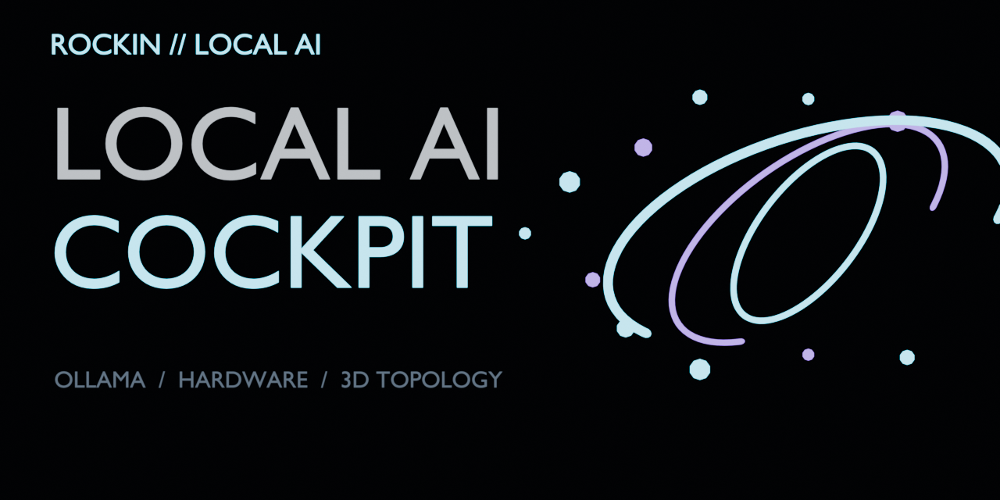
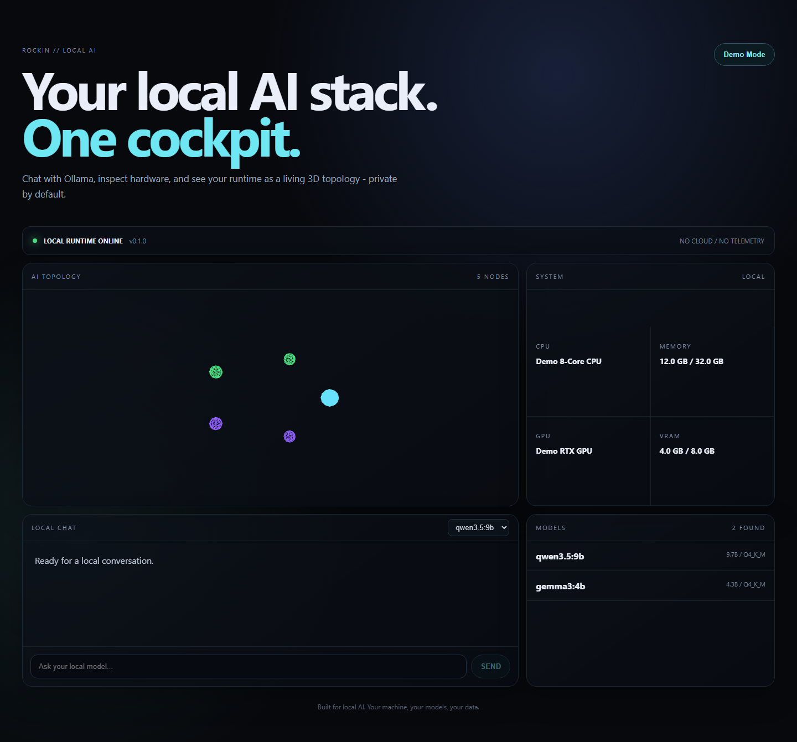

# RockIn Local AI Cockpit

**A beautiful local AI cockpit for Ollama - chat, models, hardware, and your AI stack in one interactive 3D workspace.**



## Demo



[](https://github.com/rockinai88/rockin-local-ai-cockpit/actions/workflows/ci.yml)
[](LICENSE)
[](SECURITY.md)

## Why

Most AI dashboards hide the machine. RockIn Local AI Cockpit makes your local runtime visible: Ollama models, system resources, chat, and a bounded 3D topology in one privacy-first interface.

## Quick start

Requirements: Node.js 22.12+ and optionally Ollama.

```bash
git clone https://github.com/rockinai88/rockin-local-ai-cockpit.git
cd rockin-local-ai-cockpit
npm ci
npm run dev:web
```

Open `http://127.0.0.1:5173`. Demo Mode works without Ollama. For live local chat, start Ollama, run `npm run dev:server` in another terminal, then switch to Live Ollama.

## Highlights

- Local Ollama model discovery and chat
- CPU, RAM, GPU and VRAM telemetry
- Interactive Three.js AI topology
- Deterministic Demo Mode - no model download required
- Loopback-only backend with bounded contracts
- No telemetry, remote fonts, cloud account or API key
- Responsive UI and reduced-motion support

## Architecture

Browser -> local API (`127.0.0.1:43123`) -> Ollama (`127.0.0.1:11434`). The browser never receives environment variables or filesystem paths. See [architecture](docs/architecture.md).

## Verify

```bash
npm run verify
```

The gate runs formatting, lint, TypeScript, unit tests, production build, browser smoke, npm security audit and clean-room scans.

## Roadmap and contributing

See [ROADMAP.md](ROADMAP.md) and [CONTRIBUTING.md](CONTRIBUTING.md). Security issues belong in [SECURITY.md](SECURITY.md), not public issues.

## Independence

RockIn Local AI Cockpit is an independent community project. Ollama is a separate project and trademark of its respective owner.

## License

MIT - see [LICENSE](LICENSE).
